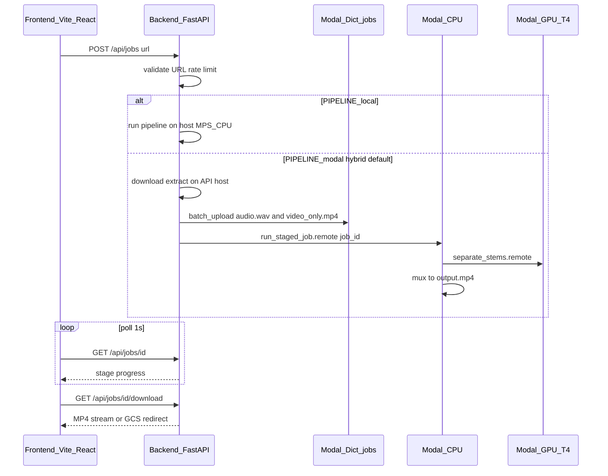

# Karaoke web app — plan & agent handoff

**Last updated:** 2026-10-06
**Owner context:** Standalone app under `webapp-karaoke/` inside the [stemdeck](https://github.com/kittipatkampa/stemdeck) repo. **Do not modify** `lovable-karaoke/` (separate Lovable.dev project). Reuse ideas from `scripts/karaoke.py` only by copying patterns into `webapp-karaoke/pipeline/`.

---

## 1. Product goal

Build a web app where a user:

1. Pastes a **YouTube URL**
2. Clicks **Make it**
3. Sees a **4-stage progress bar**: download → extract → stem → combine
4. **Downloads** a karaoke MP4 (video + instrumental / no-vocals audio)

**Non-goals (v1):** accounts, history, lyrics, multi-stem export, non-YouTube sources.

**Legal note:** Downloading and altering YouTube content may violate YouTube ToS or copyright. Treat as personal tooling until explicitly cleared for public use.

---

## 2. Target architecture



| Layer | Tech | Host |
|--------|------|------|
| Frontend | Vite + React + TS | Local `:5173`; prod Cloud Run nginx |
| Backend | FastAPI | Local `:8000`; prod Cloud Run |
| GPU stem | Demucs `htdemucs` | Modal T4, scale-to-zero |
| Job state | JSON files (local) or `modal.Dict` (modal) | — |
| Output (current cloud staging) | Modal Volume, streamed by API | Deployed |
| Output (planned) | GCS bucket + signed URLs | Not connected |

**Reference test video:** `https://youtube.com/shorts/senFAeo0RQM`
**Reference CLI output (same repo):** `karaoke_out/*_senFAeo0RQM_karaoke.mp4`

---

## 3. Repository layout

```
webapp-karaoke/
  pipeline/           # Shared stages: urls, download, extract, demucs, mux
  backend/            # FastAPI, runners, storage, tests
  frontend/           # React UI: / and /j/:jobId
  modal/              # modal_app.py, spike_download.py
  deploy/             # GCP scripts (staging deployed)
  docs/
    HANDOFF.md        # This file
    PERFORMANCE.md    # Timings and stage weights
  Makefile            # dev, test, deploy-modal
  README.md           # Quick start
```

**Modal app name (dev):** `karaoke-maker-dev`
**Deployed:** https://modal.com/apps/kittipatkampa/main/deployed/karaoke-maker-dev

---

## 4. What is already implemented

### Pipeline (`pipeline/`)

- YouTube URL validation (watch, shorts, youtu.be)
- Max duration guard (default 600s)
- **download** — yt-dlp
- **extract** — ffmpeg → `video_only.mp4` + `audio.wav`
- **stem** — Demucs `--two-stems vocals` (`htdemucs`)
- **combine** — ffmpeg mux; **VP9 fallback** to `libx264` when `-c:v copy` fails (Modal Debian ffmpeg)
- Weighted `overall_progress` (20 / 10 / 55 / 15 %)

### Backend (`backend/app/`)

| Module | Role |
|--------|------|
| `main.py` | REST API, CORS, rate limit |
| `runner.py` | `LocalRunner` vs `ModalRunner` |
| `job_state.py` | Local job JSON under `.data/jobs/` |
| `storage.py` | Stream MP4; GCS signed URL hook (prod) |
| `settings.py` | Env vars |

**API**

- `POST /api/jobs` → `202 { job_id }`
- `GET /api/jobs/{id}` → status, stage, progress, title, error
- `GET /api/jobs/{id}/download` → MP4 attachment (or `302` to GCS when configured)
- `GET /healthz` or `/api/healthz` → `pipeline`, `modal_local_download` when modal
- `GET /api/access`, `POST /api/access` → family access-code status and unlock

### Frontend (`frontend/`)

- Home: access-code gate (when configured), then URL + **Make it** → navigates to `/j/:jobId`
- Job page: 4-step progress, download + `<video>` preview on success

### Modal (`modal/modal_app.py`)

- **GPU:** `separate_stems` (Demucs on `audio.wav` → `no_vocals.wav`)
- **CPU:** `run_job` (full pipeline on Modal — blocked by YouTube bot check without cookies)
- **CPU:** `run_staged_job` (hybrid path: reads uploaded files from Volume, stems + muxes)
- **Volume:** `karaoke-maker-dev-work` at `/data/karaoke/jobs/{id}/`
- **Dict:** `karaoke-maker-dev-jobs`
- **Cron:** `cleanup_old_jobs` (24h)
- Optional secrets via `MODAL_SECRETS` (comma-separated names)

### Tests

- `make test` — URL, progress, access gate, stale jobs, API smoke (14 passed, 2 integration tests skipped on 2026-10-06)
- `RUN_PIPELINE_INTEGRATION=1` — full local pipeline on test Short (~21s MPS)
- `RUN_MODAL_SMOKE=1` — live Modal hybrid API test; `MODAL_SMOKE_JOB_ID=<completed ID>` rechecks an existing job without a new GPU run

### GCP

- Project `karaoke-machine-kk-20261006` under `kittipat@gmail.com`, with billing linked, service accounts and three secrets in place.
- Cloud Run API and frontend are deployed. Same-origin access unlock, existing job status, and a 206 MP4 range response passed. A fresh job through Cloud Run is pending a dedicated YouTube cookie file. See `deploy/README.md`.

---

## 5. Pipeline modes (critical for agents)

### `PIPELINE=local` (default, `make dev`)

- Entire job on API host (Apple Silicon **MPS** for Demucs).
- State in `webapp-karaoke/.data/jobs/{id}/`.
- **Works** for YouTube on residential IP without Modal cookies.

### `PIPELINE=modal` + `MODAL_LOCAL_DOWNLOAD=1` (default for modal)

**Hybrid** — implemented to avoid YouTube bot checks on Modal IPs:

1. API host: download + extract
2. Upload `audio.wav` and `video_only.mp4` to the Modal Volume with `batch_upload()`
3. Call `run_staged_job.remote(job_id)`; the Modal container reloads the Volume before reading the files
4. Modal: GPU stem → CPU mux → output on Volume

Start API:

```bash
cd webapp-karaoke/backend
PIPELINE=modal MODAL_LOCAL_DOWNLOAD=1 KARAOKE_MODAL_APP=karaoke-maker-dev \
  FRONTEND_ORIGIN=http://localhost:5173 \
  uv run uvicorn app.main:app --reload --host 127.0.0.1 --port 8000
```

Frontend: `cd webapp-karaoke/frontend && npm run dev` (or `make dev` for both).

### `PIPELINE=modal` + `MODAL_LOCAL_DOWNLOAD=0`

Full download on Modal CPU (`run_job`). Requires **`youtube-cookies`** Modal secret (`YTDLP_COOKIES_B64`). Use for Cloud Run if API cannot download YouTube.

---

## 6. Modal pitfalls (read before changing code)

| Issue | Symptom | Fix |
|--------|---------|-----|
| yt-dlp on Modal IP | Bot check on metadata/download | Hybrid download on API host, or cookies secret |
| `volume.commit()` from laptop | `commit() can only be called on a mounted volume inside a container` | Never commit from backend; only inside `@app.function` |
| Stale volume across containers | `missing no_vocals.wav` after GPU step | `volume.reload()` after `separate_stems.remote()` and at GPU entry |
| Local `Path` passed to `.remote()` | Container tries to open a Mac path | Upload both files with `Volume.batch_upload()`, then pass only `job_id` |
| Stale Volume view | `missing video_only.mp4` after upload | Call `volume.reload()` in `run_staged_job` before reading |
| VP9 Shorts | `ffmpeg mux failed exit 1` on Modal | `mux_karaoke` falls back to `libx264` (see `pipeline/stages.py`) |
| Image build order | Modal error after `add_local_dir` + `run_function` | `run_function` before `add_local_dir(..., copy=True)` on GPU image |

---

## 7. Environment variables

| Variable | Default | Notes |
|----------|---------|--------|
| `PIPELINE` | `local` | `local` \| `modal` |
| `MODAL_LOCAL_DOWNLOAD` | `1` | Hybrid when `modal` |
| `KARAOKE_MODAL_APP` | `karaoke-maker-dev` | Must match deployed Modal app |
| `FRONTEND_ORIGIN` | `http://localhost:5173` | CORS |
| `MODAL_SECRETS` | (empty) | e.g. `youtube-cookies,gcp-upload` at **deploy** time |
| `YTDLP_COOKIE_FILE` | — | Local path for API-side download |
| `GCS_OUTPUT_BUCKET` | — | Enables GCS redirect on download |
| `MAX_CONCURRENT_JOBS` | `2` | |
| `MAX_DURATION_SEC` | `600` | |
| `ACCESS_CODE` | (empty) | Shared family code; required in Cloud Run |

Modal token: `~/.modal.toml` / `modal profile` (user: `kittipatkampa`).

---

## 8. Remaining work (prioritized backlog)

### P0 — Modal hybrid E2E (verified 2026-10-06)

- [x] New job → done → download with `PIPELINE=modal` + hybrid (job `7a495555e366`)
- [x] Download reads Modal Volume path `karaoke/jobs/{id}/output.mp4`; range GET returned 206 and 1,024 bytes
- [x] Browser preview played the completed MP4 through the Vite `/api` proxy (local port 5174)

The test output was a 16.89-second VP9/AAC MP4. The opt-in smoke test passed against the completed job. The default test suite does not submit a new Modal job.

### P1 — Production GCP (staging deployed, new cloud job pending)

- [x] Install `gcloud`; create project `karaoke-machine-kk-20261006` under `kittipat@gmail.com` with billing
- [x] Run `deploy/setup-gcp.sh`, build both images, and deploy backend/frontend to Cloud Run
- [x] Store Modal token pair and family access code in Secret Manager; verify same-origin proxy, access cookie, existing job status, and 206 MP4 range response
- [x] Set Cloud Run to `MODAL_LOCAL_DOWNLOAD=0` to avoid background threads
- [ ] Add a dedicated YouTube cookie file to Modal, deploy `karaoke-maker-prod`, and verify a **new** cloud job through the public URL

### P2 — Hardening

- [x] Family access code before job/status/download requests; Cloud Run max instances = 1
- [x] Modal workspace spend limit set to $5 in monthly charges after credits, on 2026-10-06
- [x] Deploy 30-minute stale-job handling to Cloud Run and 24-hour Dict/Volume cleanup to the dev Modal app; stale handling passed unit tests. The scheduled cleanup has not yet reached its first eligible old cloud job.
- [ ] Tune progress weights from Modal T4 timings (`docs/PERFORMANCE.md`)

### P3 — Nice to have

- [ ] SSE instead of 1s polling
- [ ] Automated Playwright E2E against `make dev`
- [ ] Compare webapp output to `karaoke_out` reference (duration, ffprobe)

---

## 9. Agent task recipes

### Agent A — “Fix modal download”

1. Read `backend/app/runner.py` (`ModalRunner._download_locally_then_modal`)
2. Read `modal/modal_app.py` (`run_staged_job`, `_finish_stem_and_mux`)
3. Upload files to the Volume before calling `run_staged_job.remote(job_id)`
4. Redeploy: `cd webapp-karaoke/modal && KARAOKE_MODAL_APP=karaoke-maker-dev modal deploy modal_app.py`

### Agent B — “GCP deploy”

1. Read `deploy/README.md` end-to-end
2. Do not commit secrets
3. Order: backend → frontend → update CORS

### Agent C — “Frontend polish”

1. `frontend/src/pages/JobPage.tsx` — polling, error UX
2. Keep API types in `frontend/src/api.ts` in sync with `backend/app/main.py`

### Agent D — “Pipeline quality”

1. `pipeline/stages.py` — demucs progress, mux fallbacks
2. Run: `RUN_PIPELINE_INTEGRATION=1 make test` (from `backend/`)

---

## 10. Verification checklist

**Local (`PIPELINE=local`)**

```bash
cd webapp-karaoke && make dev
# Submit test Short → all 4 stages → download MP4
```

**Modal hybrid**

```bash
# Terminal 1: backend PIPELINE=modal (see §5)
# Terminal 2: frontend npm run dev
curl -s http://127.0.0.1:8000/healthz
# Expect: "pipeline":"modal","modal_local_download":"1"
```

**Unit tests**

```bash
cd webapp-karaoke && make test
```

**Modal deploy**

```bash
cd webapp-karaoke && make deploy-modal
```

---

## 11. Related files outside `webapp-karaoke/`

| Path | Use |
|------|-----|
| `scripts/karaoke.py` | Reference CLI; pins and behavior |
| `karaoke_out/` | Golden MP4 for test Short |
| `lovable-karaoke/` | **Out of scope** — do not edit |

---

## 12. Original plan reference

The detailed phase plan (local-first, then GCP) was captured in the Cursor plan file `karaoke_web_app_plan_20475d05.plan.md` (user workspace). This handoff reflects **as-built** behavior and **production learnings** that diverged slightly (hybrid Modal download, mux VP9 fallback, volume reload, `.remote()` for files).

When in doubt: **prefer `PIPELINE=local` for fast iteration**; use **modal hybrid** to validate GPU path before GCP.
